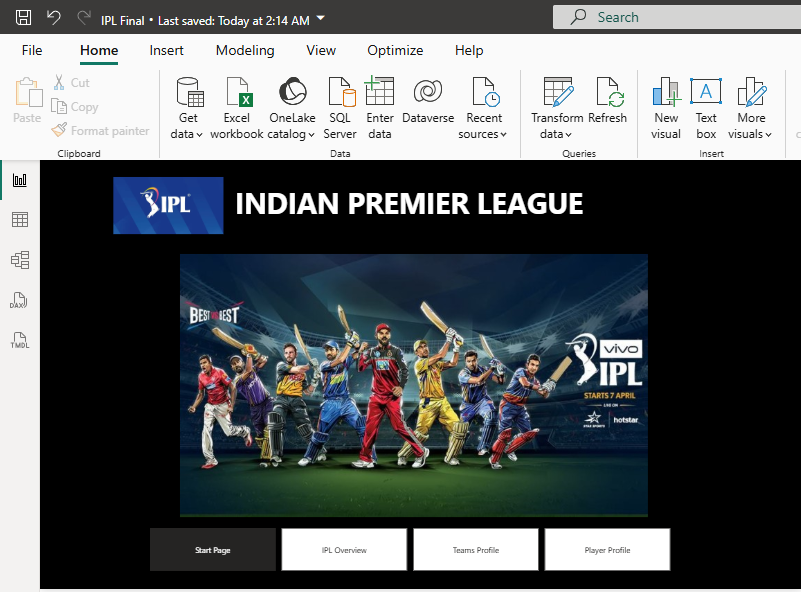
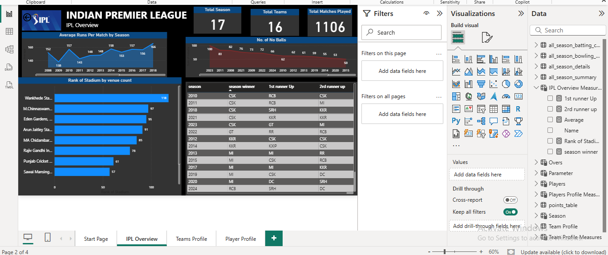

# Indian-Prepier-League
This repository contains IPL data analysis using Power BI. It includes dashboards for player performance, team comparisons, match statistics, and season-wise insights to better understand trends in the Indian Premier League.
# Power BI Portfolio Project - [Project Name]

## Project Overview
This project demonstrates my Power BI skills through the development of an interactive report/dashboard for Indian Premier League.

## Key Features
- Key Visualizations: 
1. Rank of Stadium by No. of Matches,
2. Average Runs per Match by Season,
3. No. of No Balls by Season,
4. Top 5 players of the Team by Season
5. Top Batsman of the Season
6. Top Bowler of the Season
- Calculations: Created DAX measures for [e.g., Total Sales, Year-to-Date Sales, Growth %]
- Interactive Elements: Slicers and filters for user-driven analysis

## Screenshots

d).
- Explore the pre-built reports and interact with the slicers.
