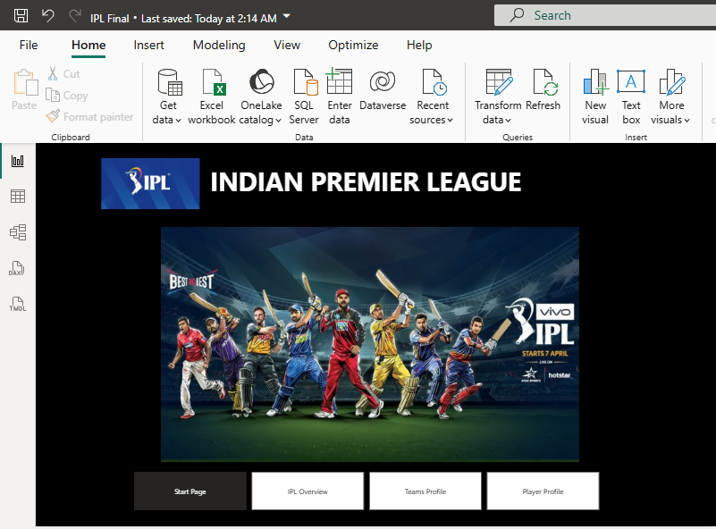
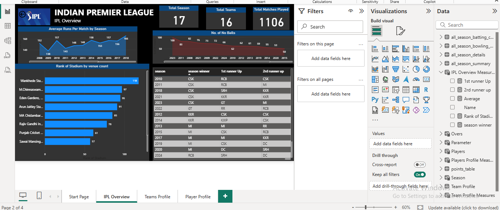

# Indian-Prepier-League
This repository contains IPL data analysis using Power BI. It includes dashboards for player performance, team comparisons, match statistics, and season-wise insights to better understand trends in the Indian Premier League.
# Power BI Portfolio Project - [Project Name]

## Project Overview
This project demonstrates my Power BI skills through the development of an interactive report/dashboard for Indian Premier League.

## Key Features
- Key Visualizations: 
1. Rank of Stadium by No. of Matches,
2. Average Runs per Match by Season,
3. No. of No Balls by Season,
4. Top 5 players of the Team by Season
5. Top Batsman of the Season
6. Top Bowler of the Season
- Calculations: Created DAX measures for
1. Season winner, 1st runner up, 2nd runner up,Rank of stadium (IPL Overview)
2. Batting rank, Player runs, Venue count, Winning ground (Teams Profile)
3. Player runs, Top Batsman of the season, Top Bowler of the season, Runs conceded,Strike rate, Economy rate (Players profile)
- Interactive Elements:
1. Team Slicer: Created a slicer for IPL teams to assess and compare team performances interactively.

2. Season Parameter & Slicer: Implemented a parameter-based slicer to dynamically control and filter data by season.

3. Over Parameter & Slicer: Added an over-based parameter and slicer to analyze match performance over specific overs.
## Screenshots

d).
